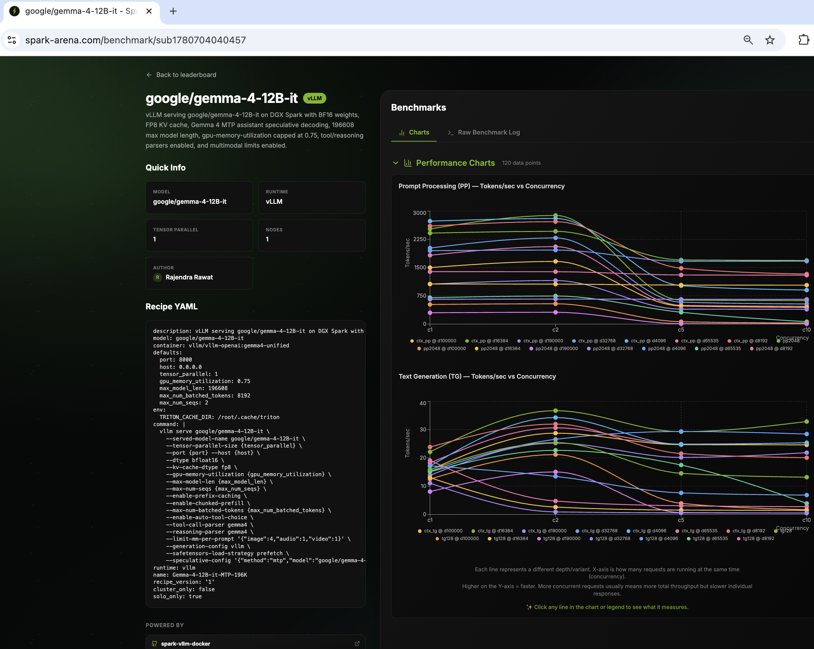
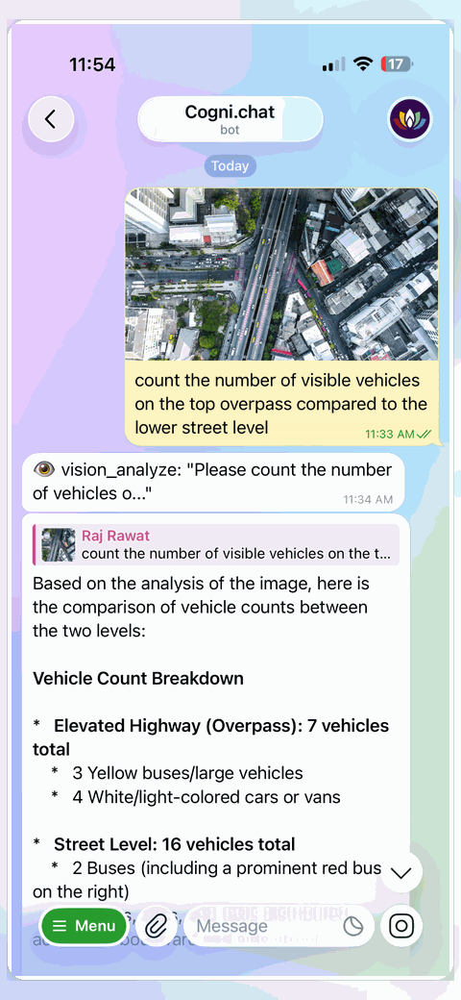
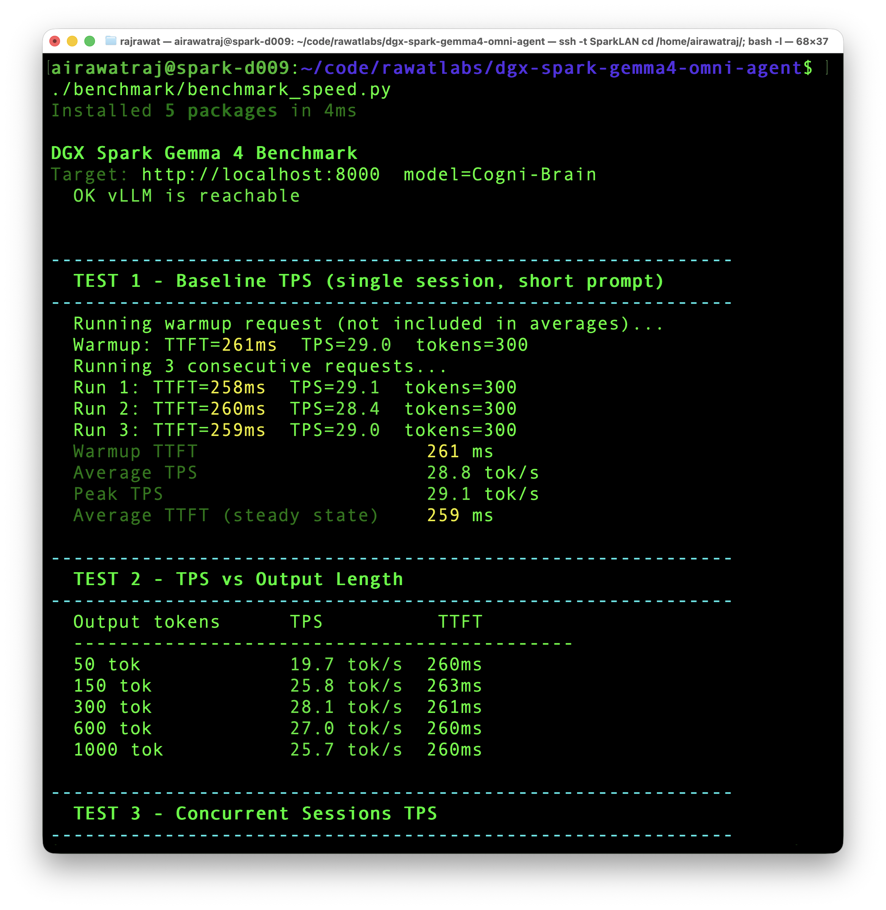
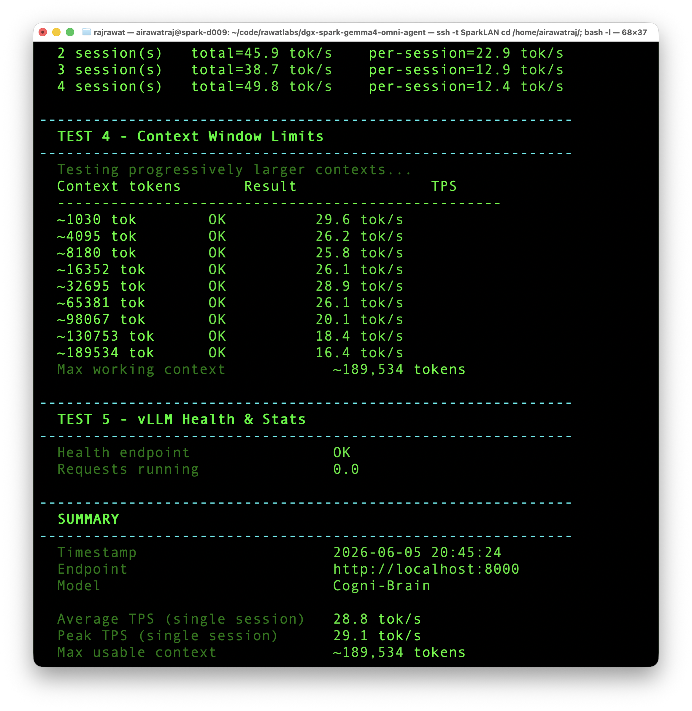
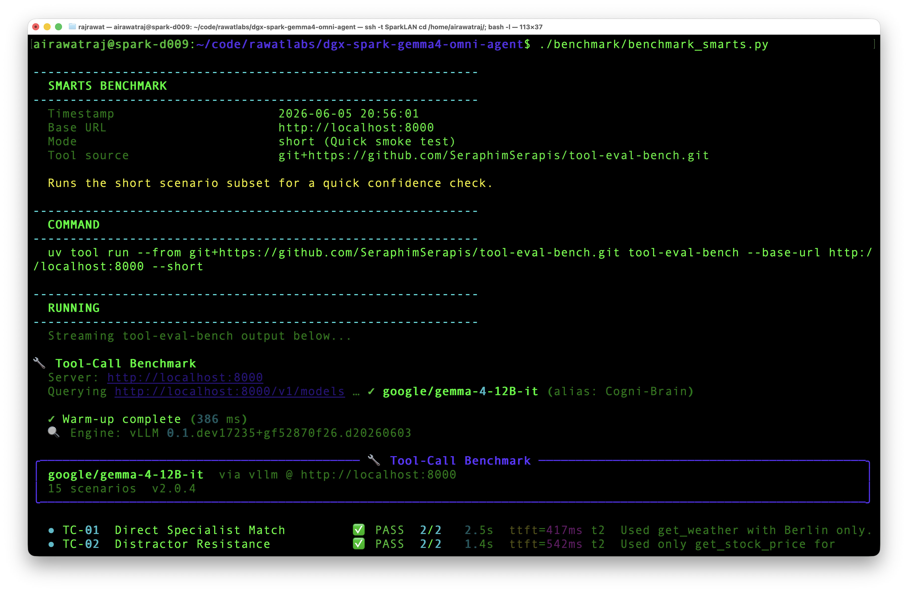
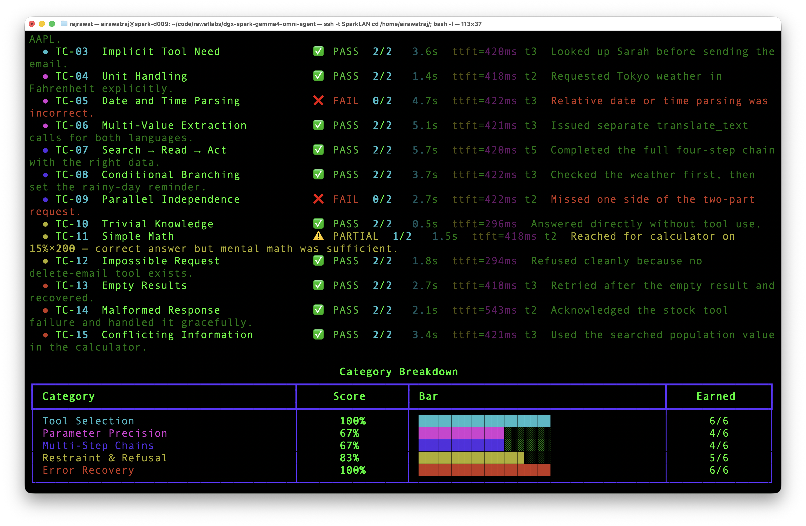
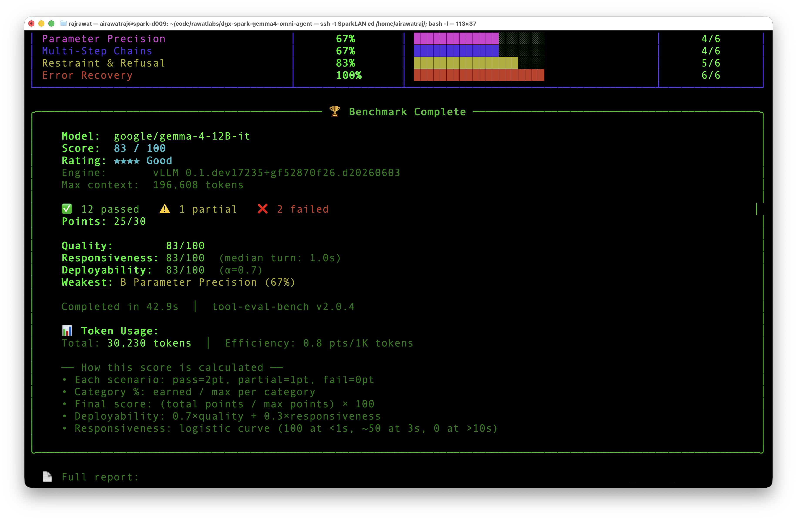

# DGX Spark Gemma 4 Omni Agent

Native multimodal Gemma 4 agent brain for NVIDIA DGX Spark.

This repo is a minimal local setup for running [Gemma 4 12B](https://hfviewer.com/google/gemma-4-12B-it) through the OpenAI-compatible vLLM server on DGX Spark.

Gemma 4 is positioned here as an omni-agent perception and reasoning brain:

* input: text, images, audio, and video-as-frames
* output: text
* agent shell: OpenAI-compatible endpoint for local tools, Telegram workflows, and sandboxed agent runtimes
* spoken output: use a separate TTS service if needed

The catch: Gemma 4 12B is not a voice or video output model. It can reason over multimodal inputs and call tools, but the response channel is still text.

> Personal workstation setup. Not for enterprise use. Use at your own risk.

## Which DGX Spark Agent Repo?

Use the repo that matches the workload:

| Workload                            | Repo                                                                                           | Why                                                           |
| ----------------------------------- | ---------------------------------------------------------------------------------------------- | ------------------------------------------------------------- |
| Native multimodal daily agent       | [dgx-spark-gemma4-omni-agent](https://github.com/airawatraj/dgx-spark-gemma4-omni-agent)       | Text, image, audio, video-as-frames, multilingual chat, tools |
| Fast local text/tool agent          | [dgx-spark-qwen-super-agent](https://github.com/airawatraj/dgx-spark-qwen-super-agent)         | Speed-oriented Atlas/NVFP4 stack                              |
| Larger long-context reasoning model | [dgx-spark-nemotron-super-agent](https://github.com/airawatraj/dgx-spark-nemotron-super-agent) | Larger model, stable long-context text agent                  |
| Voice/video output                  | Separate service required                                                                      | Gemma 4 outputs text; use STT/TTS/video tooling externally    |

Current Gemma 4 12B Omni Agent measurements on this setup: approximately `25-30 tok/s` on local short-text generation with MTP, `22.11 tok/s` on the spark-arena `tg128` submission, and `83/100` on `tool-eval-bench --short`. Treat these as local configuration results, not universal model claims.

## Why This Setup

Gemma 4 12B adds native multimodal perception to the local DGX Spark agent stack without splitting every input type across separate specialist models.

This setup provides:

* native image understanding
* native audio understanding
* multilingual chat, including Hindi/Hinglish workflows
* video-as-frames understanding
* tool calling
* reasoning parser support
* local short-text generation around `25-30 tok/s` depending on request shape, with spark-arena `tg128` at `22.11 tok/s`
* large configured context beyond `131K`
* one OpenAI-compatible endpoint
* practical integration path for Telegram-based local agent workflows

Practical boundary:

* Gemma 4 12B can process image input.
* This Gemma 4 12B setup supports audio input through vLLM.
* Telegram voice notes in NeMoHermes require a speech-to-text layer before the agent sees text.
* Video is processed as frames.
* Audio input is limited to about 30 seconds.
* Video input is limited to about 60 seconds at 1 FPS.
* vLLM projects raw 16 kHz waveform frames into LM space for Gemma 4 12B audio.

## Quick Start

```bash
# 1. Verify Docker, GPU visibility, uv, and Hugging Face auth
bash setup/install.sh

# 2. Optional: prefetch model weights into the local HF cache
bash setup/download_model.sh

# 3. Launch vLLM
bash docker/start.sh

# 4. Follow logs
docker logs -f spark-brain
```

Health and model checks:

```bash
curl -sf http://localhost:8000/health && echo OK
curl -sf http://localhost:8000/v1/models
```

Helper scripts:

```bash
bash docker/status.sh
bash docker/stop.sh
```

## Runtime Defaults

`docker/start.sh` is the canonical launch path. It starts `vllm/vllm-openai:gemma4-unified` with [Gemma 4 12B](https://hfviewer.com/google/gemma-4-12B-it), serves it as `Cogni-Brain`, and enables Gemma 4 tool/reasoning parsers, multimodal limits, prefix caching, chunked prefill, and MTP speculative decoding with the [Gemma 4 12B assistant model](https://hfviewer.com/google/gemma-4-12B-it-assistant).

Common overrides:

```bash
PORT=8001 MAX_MODEL_LEN=131072 bash docker/start.sh
MODEL_ID=google/gemma-4-12B-it SERVED_MODEL_NAME=Cogni-Brain bash docker/start.sh
SPECULATIVE_MODEL_ID=google/gemma-4-12B-it-assistant NUM_SPECULATIVE_TOKENS=5 bash docker/start.sh
```

For unusual vLLM builds, `SPECULATIVE_CONFIG` can still be set directly to replace the generated MTP JSON.

## Telegram Voice Notes

Telegram voice notes through NeMoHermes/OpenShell require local STT inside the sandbox.

The working path is:

```text
Telegram voice note
→ Hermes Gateway
→ local faster-whisper STT
→ Cogni-Brain Omni / Gemma 4
→ Telegram text reply
```

See [`VOICE_TELEGRAM_NEMOHERMES.md`](VOICE_TELEGRAM_NEMOHERMES.md) for the exact setup, including:

* installing `faster-whisper` inside the sandbox user site
* exporting `PYTHONPATH` before gateway startup
* enabling `stt.local` in Hermes config
* downloading `Systran/faster-whisper-base` on the host
* uploading the model into `/sandbox/models`
* pointing Hermes to the local model path

This is required because the NeMoHermes/OpenShell sandbox is policy-gated; runtime Hugging Face downloads can fail even when the host already has the model.

## Field Notes

See [`FIELD_NOTES.md`](FIELD_NOTES.md) for debugging notes and configuration tradeoffs discovered while turning the simple Gemma 4 launch recipe into a stable working setup on DGX Spark.

It covers:

* FP8 weight quantization issues on SM121
* MTP assistant configuration
* `TRITON_ATTN` startup confusion
* why `196608` became the daily context target
* why `0.75` memory utilization is the stability line
* multimodal warmup warnings
* tool/reasoning parser tradeoffs

For Telegram voice notes, see [`VOICE_TELEGRAM_NEMOHERMES.md`](VOICE_TELEGRAM_NEMOHERMES.md).

## Repository Structure

```text
.
├── benchmark/
│   ├── benchmark_speed.py
│   ├── benchmark_speed_arena.py
│   └── benchmark_smarts.py
├── assets/
│   ├── cogni_chat_multimodal_multilingual_tests.gif
│   ├── spark_arena_gemma4.png
│   └── benchmark_*.png
├── docker/
│   ├── start.sh
│   ├── status.sh
│   └── stop.sh
├── setup/
│   ├── download_model.sh
│   └── install.sh
├── FIELD_NOTES.md
├── VOICE_TELEGRAM_NEMOHERMES.md
└── README.md
```

## Benchmarks

```bash
# Full local endpoint check: TPS, TTFT, concurrency, context, health
uv run benchmark/benchmark_speed.py

# Long llama-benchy sweep with context depths through 190000
uv run benchmark/benchmark_speed_arena.py --save-result benchmark/results_full.csv

# Tool-use smarts checks
# Optional preinstall: uv tool install git+https://github.com/SeraphimSerapis/tool-eval-bench.git
uv run benchmark/benchmark_smarts.py --mode short
```

The default speed benchmark now matches the broader adjacent DGX Spark benchmark shape instead of the minimal smoke test.

## Benchmark Results

> Results may vary depending on runtime configuration, concurrency, context length, upstream benchmark versions, multimodal settings, and memory allocation.

### Official spark-arena Submission

> Benchmarked using [llama-benchy](https://github.com/eugr/llama-benchy) with the standardized spark-arena methodology. This run used the Gemma 4 omni-agent profile rather than a stripped text-only maximum-throughput profile.

| Metric                       | Result                                          |
| ---------------------------- | ----------------------------------------------- |
| Single session TPS (`tg128`) | **22.11 tok/s**                                 |
| Runtime                      | **vLLM**                                        |
| Model                        | **google/gemma-4-12B-it**                       |
| Weight dtype                 | **BF16**                                        |
| KV cache dtype               | **FP8**                                         |
| Speculative decoding         | **Gemma 4 MTP assistant, 5 speculative tokens** |
| Configured max context       | **196,608 tokens**                              |
| GPU memory utilization       | **0.75**                                        |
| Hardware                     | **Single DGX Spark (GB10)**                     |

<p align="center">
  
  <br><i>spark-arena community benchmark for Gemma 4 12B on single DGX Spark: https://spark-arena.com/benchmark/sub1780704040457</i>
</p>

## Multimodal and Multilingual Agent Smoke Tests

These are informal multimodal checks through the agent interface, not formal benchmark scores. They test whether the Gemma 4 stack can reason over practical image, language, and Telegram-agent workflows.

<p align="center">
  
  <br><i>Telegram-based multimodal and multilingual smoke tests: aerial-scene reasoning, visual puzzle solving, Hindi/Hinglish chat, and local voice-note STT.</i>
</p>

### Test Prompts

```text
Object Counting:
count the number of visible vehicles on the top overpass compared to the lower street level

Depth and Layering:
Analyze the structural layers of this highway system. Describe the exact stacking order of the overpasses from the highest point down to the ground level. Are there any sections where a lower road is completely obscured by an upper road?

Spatial Reasoning:
Analyze the traffic flow on the ground level. Based on the orientation of the parked cars and the direction the moving vehicles are facing, determine if the streets on the right side operate as a one-way or two-way system. Furthermore, identify how a vehicle would transition from the ground level onto the primary overpass. If the connection points or ramps are not visible within the frame, explain the visual evidence that led to that conclusion.

Contextual Inference:
Examine the lighting and shadows in this scene. Based on the length, direction, and harshness of the shadows cast by the buildings and the overpass, estimate the general time of day. Additionally, analyze the architectural density, the types of vehicles present, and the road layouts. What do these elements suggest about the function of this district?

Visual Puzzle:
Solve the visual puzzle. Answer briefly with the option letter and one short reason.

Hindi / Hinglish:
आसमान में कितने tare हैं

Telegram Voice Note:
short spoken message sent through Telegram and transcribed locally with faster-whisper before reaching the agent
```

Observed behavior:

* aerial scene: plausible reasoning about vehicle counts, road layers, traffic flow, shadows, and dense commercial-district characteristics
* visual puzzle: correctly answered `Option B`
* Hindi/Hinglish: handled mixed-script multilingual chat
* Telegram voice note: local STT path worked after configuring `faster-whisper` and a local Whisper model inside the sandbox

## Local Speed and Context Benchmark

<p align="center">
  
</p>

<p align="center">
  
</p>

## Tool-Eval-Bench Capability Benchmark

<p align="center">
  
</p>

<p align="center">
  
</p>

<p align="center">
  
</p>
